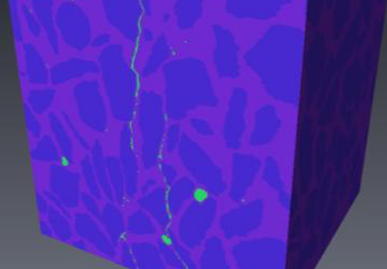

---
jupytext:
  text_representation:
    extension: .md
    format_name: myst
    format_version: 0.13
    jupytext_version: 1.14.1
kernelspec:
  display_name: Python 3 (ipykernel)
  language: python
  name: python3
---

+++ {"lang": "fr", "slideshow": {"slide_type": "slide"}}

**Programming Course** - ***Master 1 PSL - Science et Génie des Matériaux / Énergie*** 

---------------

# Python for engineering

**Basile Marchand (Centre des Matériaux- Mines ParisTech / CNRS / PSL University)**

<a href="https://twitter.com/BasileMarchand?ref_src=twsrc%5Etfw" class="twitter-follow-button" data-size="large" data-text="Follow me on Twitter" data-show-count="false">Follow @BasileMarchand</a>

+++ {"lang": "en", "slideshow": {"slide_type": "slide"}}

## Programming for IT specialists only ?

+++ {"lang": "en", "slideshow": {"slide_type": "subslide"}}

### A need for the all the engineer nowadays

+++ {"lang": "en", "slideshow": {"slide_type": "fragment"}}

Given the evolution of engineering practices, it is unthinkable for an engineer, whether he is an expert in numerical simulation, a specialist in data management or an experimenter, not to have some basic knowledge of programming. Let's consider the example of an engineer in experimental mechanics whose main activity is to perform mechanical tests on various materials. At first sight, we could say that this person's needs in terms of computer development are quite low. However, this is a completely false vision of reality because today the result of a mechanical test is not limited to a point file (Excel type) containing only two columns and a few dozen lines. Today's experimental activities, whether they are mechanical tests or not, are sources that generate large volumes of data, several GB to several TB of data. It is therefore completely unthinkable to process these volumes of data by hand, or even with spreadsheet software such as Excel.

+++ {"lang": "en", "slideshow": {"slide_type": "subslide"}}

If I return to my example of the engineer in mechanics of materials and structures, the tests are nowadays carried out on series, potentially important of specimens, with consequent means of acquisition such as for example the cameras, fast camera. For a few years, the trend is also to develop *in-situ* tests with the monitoring of tests by tomography, the principle is to look inside the material during its solicitation.

It is therefore easy to understand that these new practices generate gigantic volumes of data that it is simply inconceivable to process other than by computer science and the programming of specific methods.

+++ {"lang": "en", "slideshow": {"slide_type": "slide"}}

## Why is python among so many different solutions?

+++ {"slideshow": {"slide_type": "fragment"}}

A natural question is why learn Python rather than another language? Indeed, in the world of computer science and programming, there is a whole zoology of programming languages (several hundreds). Why Python more than any other then?

+++ {"lang": "en", "slideshow": {"slide_type": "subslide"}}

**Python is Open Source, ...**.

This implies that there is no paid license needed to use Python, unlike Matlab which is a paid software. Anyone can install Python on his personal computer for free, write and redistribute Python programs freely.

+++ {"slideshow": {"slide_type": "subslide"}}

**... has a very large and active community**.

The Python language being open source it has a very large *geek* community, from the high school student who does it for fun on weekends to the research engineer in data analysis at Google. So there are many forums where most of the problems you will encounter have already been discussed and solved. One of the most active forums being stackoverflow. So if you are having trouble doing something don't hesitate to check it out. 
Another important aspect of this very active community, besides the forums and tutorials, are the available modules. We'll see in the rest of the course but Python *basically* can't do a lot of things, for what we are interested in anyway. On the other hand there is an exorbitant number of additional modules developed by people from all walks of life to enrich the language with additional features, for example matrix calculation, image analysis, graphing, ...

+++ {"slideshow": {"slide_type": "subslide"}}

**and finally it is easy to learn since it is high level.**

Finally, one of the reasons for choosing Python rather than anything else is that it is a high level language as opposed to low level languages (such as FORTRAN, C, ... ). 

Moreover, Python is an interpreted language which facilitates the learning and the debugging development process. 

**Note:** A programming language is said to be interpreted, as opposed to compiled, when the design process is limited to : (i) writing the program; (ii) execution. While a compiled language has an additional step between writing and execution, it is the compilation step. The purpose of this compilation step is to translate the program written by the programmer (in C/C++/FORTRAN/...) into a set of machine instructions and it is then this set of instructions that is executed when the program is run.

+++ {"lang": "en", "slideshow": {"slide_type": "slide"}}

## Prerequisites, objectives and evaluation

+++ {"lang": "en", "slideshow": {"slide_type": "subslide"}}

The objective of this course is to give you the necessary basics in Python that will allow you to: (i) be comfortable with automated and efficient experimental data processing; (ii) be able to run simple numerical simulation programs; (iii) have a sufficient understanding of Python to allow you to search for information on the forums or in the documentation of the additional modules.

No particular pre-requisite is necessary for the good understanding of the course, except for knowing how to use a computer. The course is divided into 6 sessions of 3 hours each. The evaluation of the module is done in two parts: 
* 30% of the grade is based on participation, attendance and investment during the practical sessions
* 70% of the grade is based on the realization of a project in pairs (the subject of which will be given at the penultimate session) which will be the subject of a defense (about 20 minutes).
