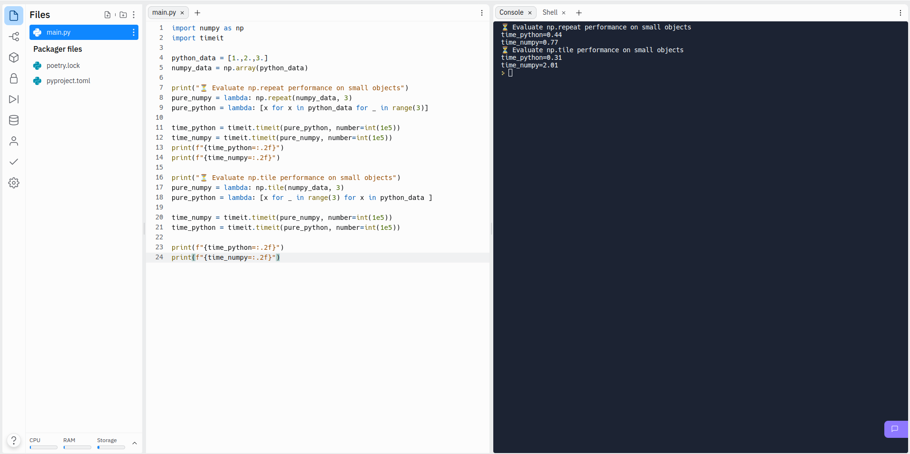
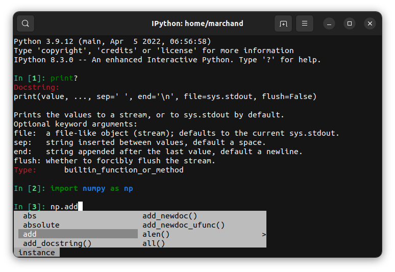
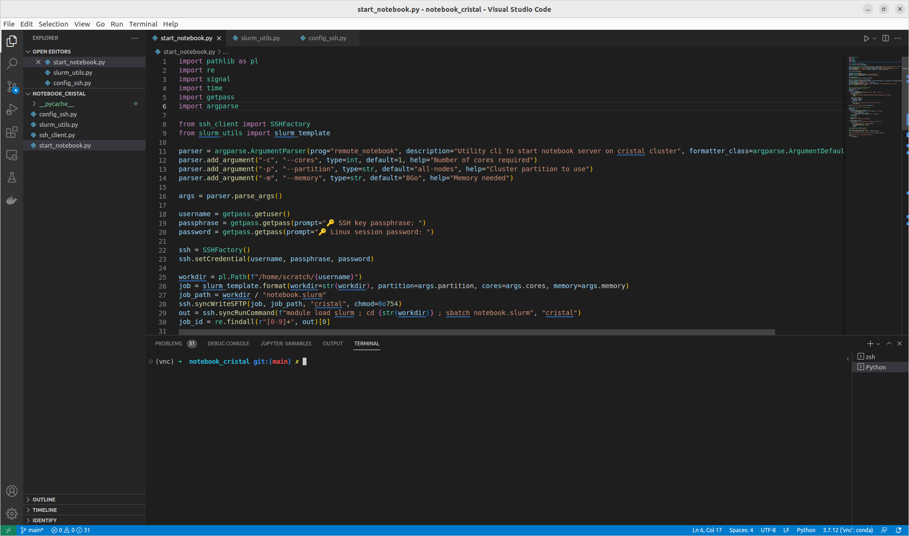

---
jupytext:
  text_representation:
    extension: .md
    format_name: myst
    format_version: 0.13
    jupytext_version: 1.14.1
kernelspec:
  display_name: Python 3 (ipykernel)
  language: python
  name: python3
---

+++ {"lang": "en", "slideshow": {"slide_type": "slide"}}

**Programming Course** - ***Master 1 PSL - Science et Génie des Matériaux / Énergie*** 

---------------

## The Python environment

**Basile Marchand (Centre des Matériaux- Mines ParisTech / CNRS / PSL University)**

<div>
<a href="https://twitter.com/BasileMarchand?ref_src=twsrc%5Etfw" class="twitter-follow-button" data-size="large" data-text="Follow me on Twitter" data-show-count="false">Follow @BasileMarchand</a><script async src="https://platform.twitter.com/widgets.js" charset="utf-8"></script>
</div>

+++ {"lang": "en", "slideshow": {"slide_type": "slide"}}

### Installation

+++ {"lang": "en", "slideshow": {"slide_type": "subslide"}}

To use Python you must first install it. On most Linux operating systems a Python is already installed, usually version 2.7, however it is recommended to follow the installation instructions below in order to have a Python environment that is identical to the one used for this course. 

The installation procedure is the same for Linux, Mac OS or Windows. There are of course many possible solutions to install Python and all its dependencies and extensions but the one chosen here (the simplest from my point of view) is to install the Python distribution Anaconda [www.anaconda.com](www.anaconda.com). The Anaconda distribution is an installation program that allows you to install Python and a wide variety of scientific modules available in the Python ecosystem very easily.

+++ {"slideshow": {"slide_type": "subslide"}}

### Online usage

+++ {"slideshow": {"slide_type": "subslide"}}

If you don't want to install Python locally on your personal machine you can use online services that allow you to do Python in the cloud ☁️

There are several possible solutions but the one I recommend in this case is the [Replit](https://replit.com/) service which will give you access to a complete environment allowing you to install all the dependencies you would need. 



+++ {"lang": "en", "slideshow": {"slide_type": "slide"}}

### Using python as a calculator

+++ {"lang": "en", "slideshow": {"slide_type": "subslide"}}

First of all, the simplest way to use Python is at the command line like a calculator. To do this: 
* On windows : in the menu->program->Anaconda3
* On Linux and Mac : open a terminal and type python 

You then have a minimalist window (called a console or a terminal) with a command prompt (the prompt) made of 3 chevrons ">>>" it's at this level that you can write Python commands. But for the moment we will only have fun using it as a calculator

```{code-cell} ipython3
---
slideshow:
  slide_type: fragment
---
2+3
```

```{code-cell} ipython3
---
slideshow:
  slide_type: fragment
---
4*3+10 ### I can put a comment behind using the # symbol
```

```{code-cell} ipython3
---
slideshow:
  slide_type: fragment
---
2-7*4.2 , 19.1*-0.354
```

+++ {"lang": "en", "slideshow": {"slide_type": "fragment"}}

To exit the Python command prompt, simply type __exit()__ or press Ctrl+d

+++ {"lang": "en", "slideshow": {"slide_type": "subslide"}}

### A more user-friendly *environment*

+++ {"lang": "en", "slideshow": {"slide_type": "subslide"}}

The console is a bit austere you might say. And I could not agree with you more. First of all for an interactive but more friendly use of python you can use `ipython`. It is what I would call a luxury console for python. The advantage is that ipython works with a cell system and has advanced completion features.  



+++ {"slideshow": {"slide_type": "subslide"}}

But for writing programs that you want to keep for future use, using the python interpreter is not possible because nothing is saved. So you need a **text editor**. 
There is a whole zoology of text editors (emacs, vi, gedit, notepad++, ...) but if you don't have a preference I can only advise you to use Visual Studio Code (https://code.visualstudio.com/). 



+++ {"lang": "en", "slideshow": {"slide_type": "subslide"}}

### For the curious ... Jupyter and notebooks

+++ {"lang": "en", "slideshow": {"slide_type": "subslide"}}

Finally, a last possible way of using Python is to use Notebooks (used for the development of this course). The concept of Notebook introduced by the Mathematica software is to have in a single file (whose rendering will be managed here by the web browser) different cells that can be made of : 

* Python code that will be interpreted
* displayed results of the Python code
* images (static or generated by Python code)
* formatted text that can contain equations

The interest of this tool is to be able to present with many explanations and a clear layout a Python program and its results. 

To create a notebook and especially to launch the interface allowing to edit them, you just have to type in your console 

```
jupyter notebook
```

This will then automatically: (i) start a local server on your computer which will be in charge of managing your notebooks; (ii) launch your web browser on the notebook home page.
