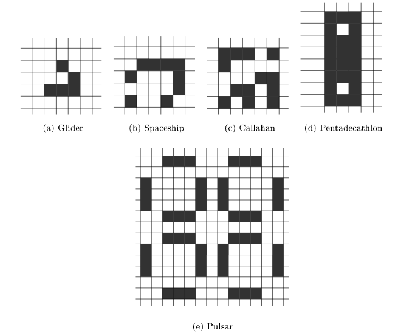
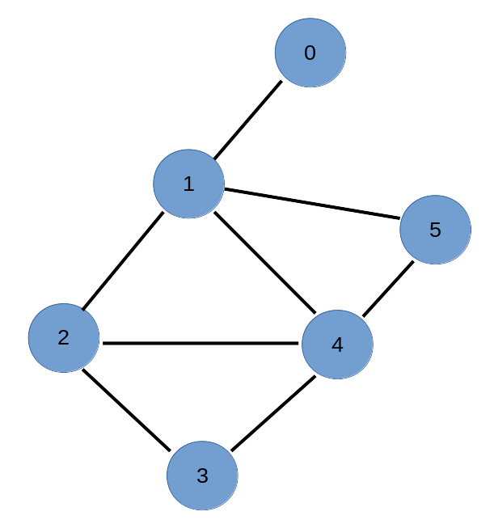

---
jupytext:
  text_representation:
    extension: .md
    format_name: myst
    format_version: 0.13
    jupytext_version: 1.14.1
kernelspec:
  display_name: Python 3 (ipykernel)
  language: python
  name: python3
---

**Programming Course** - ***Master 1 PSL - Science et Génie des Matériaux / Énergie*** 

---------------

# Project subjetcs for evaluation

**Basile Marchand (Centre des Matériaux- Mines ParisTech / CNRS / PSL University)**

<div>
<a href="https://twitter.com/BasileMarchand?ref_src=twsrc%5Etfw" class="twitter-follow-button" data-size="large" data-text="Follow me on Twitter" data-show-count="false">Follow @BasileMarchand</a><script async src="https://platform.twitter.com/widgets.js" charset="utf-8"></script>
</div>

+++

## Evaluation methods


The project is to be carried out in pairs. The evaluation of this project is broken down into two parts:

* Analysis of the code you will create. The evaluation criteria are as follows:

  * Clarity and readability of the code
  * Documentation of the code
  * Genericity of the code (must be able to work with other data sets)


* Paired presentation of approximately 15 minutes plus 10 minutes of questions

Important dates are as follows:

* **23/11/2022** before 12:00 pm: Send the code by email to basile.marchand@minesparis.psl.eu
* **24/11/2022** defenses

+++

## Analysis of a tensile test

### Subject description:

You have at your disposal in the folder *data* a set of files corresponding to the experimental data from a tensile test on a cylindrical specimen.
cylindrical specimen.

The objective of this project is to set up a Python program allowing to proceed from this set of data to the automatic analysis in order to recover the following information
The objective of this project is to set up a Python program allowing to proceed with the automatic analysis of this data set in order to recover the following information:

* Young's modulus
* Yield strength
* Stress at 0.2% of plastic deformation
* Maximum stress

The expected mode of operation is as follows:

1. The user provides the program with the path to the folder containing the experimental data to be processed. (This user input can be done in any way you want).
you want)
2. The program builds the tensile curve (stress, strain)
3. The program constructs the effective tensile curve (effective stress, strain)
4. From the previous curves, identify the material parameters requested previously.
5. Synthesize the results in a "pretty" Python display.

The data to be used can be downloaded at the following address [http://bmarchand.fr/download/data/projet1.tar.gz](http://bmarchand.fr/download/data/projet1.tar.gz)

### Notes:


To plot the tensile curve considering the effective stress you will have to measure the evolution of the useful section on the specimen (i.e. on the pictures provided).
es). For this you can use the Python module **skimage** and more particularly the function **find_contour**.

To read an image the code to use is the following:

```python
from skimage.io import imread, color
image = imread( "data/image_00.png", as_grey=True)
```

+++

## Crack propagation


### Topic Description:


You have at your disposal in the data folder a set of files corresponding to the experimental data from a cyclic crack propagation on a tubular
on a tubular shaft.

The objective of this project is to set up a Python program allowing from this set of data :

1. Identify the parameters of a crack propagation model (the model is provided below)
2. Use the identified model to simulate the progress of a crack.


The expected mode of operation is as follows:

1. The user provides the program with the path to the experimental files. (This user input can be done in any way you want)
2. The program identifies the model parameters for the different tests.
3. The program calculates the evolution of $a(N)$ using the different parameters identified in question 2.
4. Synthesize the results into a "pretty" Python display.


The data to be used for this project can be downloaded at [http://bmarchand.fr/download/data/projet2.tar.gz](http://bmarchand.fr/download/data/projet2.tar.gz)

### Notes

The crack propagation model considered in this project is the one developed in [Maurel2009]. A pdf version of the article is provided in the **data** folder.

$$ \frac{da}{dN} = \left( \frac{ W _{e}^{open} }{ \gamma_e} \cdot a \right)^{m_e} + \left( \frac{ W _{p}^{dist} }{ \gamma_p} \cdot a \right)^{m_p} $$


The parameters of the model to be identified are therefore the four scalars $\gamma_e$ $\gamma_p$ $m_e$ and $m_p$


[Maurel2009] V. Maurel, L. Rémy, F. Dahmen, N Haddar, **An engineering model for low cycle fatigue life based on a partition of energy and micro-crack growth**, International Journal of Fatigue, 2009.

+++

## Reaction-diffusion: Gray-Scott model

+++

### Topic Description:

The objective of this project is to implement a Python program to simulate a reaction-diffusion phenomenon of two species considering the Gray-Scott model.

The expected mode of operation is as follows:

1. The user provides the program with the input parameters of the problem (model coefficients, size of the simulated area, simulation time. (This user input can be done in any way you want: input at the console, reading a text file, ...)
2. The program carries out the simulation
3. The program generates every **x** time increment (x to be defined as you wish) an image representing the concentrations of the species at this moment.
4. Synthesize the results into a "pretty" Python display.

### Notes 1:

The diffusion reaction model considered in this project is the Gray-Scott model [GrayScott1983].


$$\begin{cases} \frac{\partial u }{\partial t} = r_u\left( \frac{\partial^2 u}{\partial x^2} + \frac{\partial^2 u}{\partial y^2} \right) - u\cdot v^2 + f\cdot (1 - u )  \newline
\frac{\partial v}{\partial t} = r_u \left( \frac{\partial^2 v}{\partial x^2} + \frac{\partial^2 v}{\partial y^2} \right) + u\cdot v^2 + (f+k) v
\end{cases} $$

With :

* $u$ and $v$ the concentrations of species U and V
* $r_u$ and $r_v$ the diffusion coefficients of species U and V
* $k$ and $f$ are the reaction coefficients of the chemical species

The chemical reaction associated with this model is the following:

$$ \begin{cases}
   U + 2 V \longrightarrow 3 V
   V \longrightarrow P
   \end{cases}
$$

+++

### Hints 2:

The problem to solve is to determine the evolution of $u(x,y,t)$ and $v(x,y,t)$. To do this, we must solve the following system of partial differential equations:

$$
   \begin{cases} \frac{\partial u }{\partial t} = r_u\left( \frac{\partial^2 u}{\partial x^2} + \frac{\partial^2 u}{\partial y^2} \right) - u\cdot v^2 + f\cdot (1 - u ) \\
   \frac{\partial v}{\partial t} = r_u \left( \frac{\partial^2 v}{\partial x^2} + \frac{\partial^2 v}{\partial y^2} \right) + u\cdot v^2 + (f+k) v
   \end{cases}
   $$


To do this we will have to set up a finite difference solution. The finite difference method consists of:

1. Define a discretization (spatial and temporal in this case)
2. Approximate the partial derivatives using finite differences, in the case of this project we can write.

$$
   \left. \frac{\partial u }{\partial t}\right\vert_{x=x_{i}, y=y_j,t=t_k} \simeq \frac{1}{\Delta t} \left( u(x_i,y_j, t_k + \Delta t ) -  u(x_i,y_j, t_k ) \right)
$$


$$\left. \frac{\partial^2 u }{\partial x^2}\right\vert_{x=x_{i}, y=y_j,t=t_k} \simeq \frac{1}{\Delta x ^2} \left( u(x_i + \Delta x ,y_j, t_k ) - 2u(x_i ,y_j, t_k )  + u(x_i-\Delta x,y_j, t_k ) \right)
$$


$$\left. \frac{\partial^2 u }{\partial y^2}\right\vert_{x=x_{i}, y=y_j,t=t_k} \simeq \frac{1}{\Delta y ^2} \left( u(x_i, y_j +\Delta y, t_k ) - 2u(x_i ,y_j, t_k )  + u(x_i,y_j -  \Delta y, t_k ) \right)$$

3. From the previous formulas and by re-injecting them into the system of equations to be solved we can easily determine the expression of a system that can be solved
read numerically.


For the solution of the problem you are invited to use the following sets of parameters:


| $r_u$ | $r_v$ | $f$ | $k$ |  
|-------------|-------------|-----------|-----------| 
| 0.16 | 0.08 | 0.035 | 0.065 |  
| 0.14 | 0.06 | 0.035 | 0.065 |  
| 0.16 | 0.08 | 0.06 | 0.062 |  
| 0.10 | 0.10 | 0.018 | 0.050 |  
| 0.10 | 0.16 | 0.020 | 0.050 |  
| 0.16 | 0.08 | 0.05 | 0.065 |  
| 0.16 | 0.08 | 0.035 | 0.060 |  


Finally you will notice that I have not given any indication concerning the initial conditions of the problem, i.e. the concentrations of species at time $t=0$. I leave it to your imagination.


**Last indication**: The Gray-Scott model being very classical you can very easily find on internet a Python program doing what is expected. You can have a look but it is strongly advised not to copy and paste it and hope that I won't notice it.


[GrayScott1983] P. Gray, S.K. Scott. Autocatalytic reactions in the isothermal, continuous stirred tank reactor: isolases and other forms of multistability, Chem. Eng. Sci. 1983.

+++

## Shortest path

+++

### Topic Description:

The objective of this project is to implement a Python program to determine the shortest path between two subway stations in Paris. 

The expected mode of operation is as follows:

1. The user provides the program with his starting point and destination
2. The program loads the list of metro lines
3. The program determines the optimal route
4. Synthesize the results into a "pretty" Python display.

### Hints 1

The definition of the metro lines is to be done by yourself. There are two possible approaches: 

#### Solution 1: Text file 

You define the subway lines in a text file of the following form:

```txt
Line 1
Chateau de vincennes
Berault 
...
La Defense

Line 2
...

```

#### Solution 2 : prettier
You make a request via Python to access the address https://api-ratp.pierre-grimaud.fr/v4/stations/metros/1 for example to get the stations of line 1. 


### Hint 2

To determine the shortest path the simplest solution is to use the notion of graph and to use the Dikjstra algorithm. I specify that this algorithm is very classical and therefore very well documented on the internet. You can also find some python code already done. But be careful if you copy and paste without understanding I will see it very quickly. 

### Hint 3 

For the calculation of the shortest path, shorter in terms of time, you can make the hypothesis that the travel time between two stations is identical (2 minutes) for all lines and all stations

+++

## The game of life

+++

### Topic Description:

The goal of this project is to implement in Python the Game of Life, devised by John Horton Conway in 1970.  
The game of life is not strictly speaking a game. It is in fact a cellular automaton, i.e. a model where each state leads naturally to the next state based on pre-established rules. 

The principle is the following: 
We give ourselves a grid of size $N\times N$. Each cell in the grid represents a cell that can be in only two states: (i) dead; (ii) alive. Each cell has 8 neighbors, the edge cells check periodicity conditions. To go from generation $k$ to generation $k+1$ the rules of evolution of the cells are the following: 

* If a living cell at generation $k$ is surrounded by 2 or 3 living cells then it remains alive at generation $k+1$ otherwise it becomes dead. 
* If a dead cell at generation $k$ is surrounded by exactly 2 living cells then it becomes alive at iteration $k+1$. 

The expected mode of operation is as follows: 

1. The user provides the input data: (i) grid size; (ii) initial pattern from a collection of available patterns; (iii) number of generations to be computed. 
2. The program performs all the simulations and for each generation generates an image corresponding to the state of the cells for that generation.
3. At the end the program displays the percentage of cells alive at the last generation.

### Indication

The predefined patterns that must exist at least in your program (you can add others), are the following positioned in the center of the initial grid. 




### Bonus

Once you have a working program. If you wish (this is a bonus question) you can modify your program to associate different colors to your living cells following this rule: 

* In red the cells that are alive at generation $k-1$ and $k$ but that will die at generation $k+1$
* In green the cells that were just born at generation $k$ and will still live at generation $k+1$.
* In yellow the cells that have just been born at generation $k$ and will die at generation $k+1$.
* In black the cells which are alive at generation $k-1$ and $k$ and which will be still alive at generation $k+1$

+++

## Optimal energy mix

+++

### Description of the subject

In this topic we are interested in the optimal mix for energy production using wind and solar power.  The objective is to define the optimal ratio between wind and solar taking into account the evolution of the seasons during the year. 

For this purpose we will define three models to approximate the solar $S(t)$ and wind $W(t)$ energy sources over time. And we also define $L(t)$ as an approximation of the grid power consumption. 
$$W(t) = 1 + A_W \cos \omega t$$
$$S(t) = 1 - A_S \cos \omega t$$
$$L(t) = 1 + A_L \cos \omega t$$


The time series are normalized as follows $\langle{W}\rangle = \langle{S}\rangle = \langle{L}\rangle := \frac{1}{T} \int_0^T L(t) d t = 1$. And we define: 

$$\omega = \frac{2\pi}{T} $$
$$T = 1 \,\text{year}$$

+++

All the objective of the project is to determine the parameter $$alpha \in [0,1]$ such that the following deviation function is minimal

$$\langle\left[ \alpha W(\cdot) + (1-\alpha) S(\cdot) - L(\cdot) \right]^2 \rangle = \frac1T \int_0^T \left[ \alpha W(t) + (1-\alpha) S(t) - L(t) \right]^2 \,\mathrm d t$$

+++

### Hint 

To complete this project you need to proceed as follows: 

1. Identify the parameters $A_W$, $A_s$, $A_L$. For this you have at your disposal at http://bmarchand.fr/download/data/projet_mix.zip the data measured in Europe over 4 consecutive years. It is up to you to propose an approach to identify the parameters. 
2. Identify by optimization the parameter $\alpha$ allowing to minimize the energy mix function. 
3. Introduce a time offset in the wind energy source model $W(t) = 1 + A_W \cos \left( \omega t - \phi \right)$ then identify the new value of $\alpha$ as a function of $\phi \in \left[ 0, 2\pi \right]$. 
4. Finally we introduce a constant non-renewable energy source in the energy mix $C(t) = 1 - \gamma$ and we define the new deviation function 

$$ \left\langle \left\lbrace \gamma \left[ \alpha W(t) + (1-\alpha) S(t) \right] + C( \gamma ) - L(t) \right\rbrace^2 \right\rangle $$

Define the evolution of $\alpha$ minimizing the deviation function as a function of $\gamma$

+++

## European electrical network

+++

### Description of the subject 

In this project we are going to look at the electricity production of a part of the European countries. 
You have at your disposal the data file containing the time series of the "power imbalance" for the month of January 2017 of a number of European countries. 
The data can be downloaded at the following address http://bmarchand.fr/download/data/projet_reseau.zip

+++

For this project we will have to study the graph of the European electrical network. For this we will first study the following graph: 



+++

This graph is translated by the following two lists:

```{code-cell} ipython3
nodes = [0, 1, 2, 3, 4, 5]
edges = [(0, 1), (1, 2), (1, 4),
         (1, 5), (2, 3), (2, 4),
         (3, 4), (4, 5)]
```

### Indication

1. Construct the adjacency matrix of the graph defined above. In graph theory the adjacency matrix is a symmetric square matrix. The elements of this matrix indicate which pair of nodes are adjacent in the graph. 
2. Determine the degree, denoted $k_n$, of each node in the graph. In graph theory the degree of a node is the number of segments connecting this node. 
3. Determine the incidence matrix $K$ of the graph. We will assume that the segments are always oriented from the lowest value node to the highest value node (nodes 2 to 3 and not 3 to 2). The incidence matrix in graph theory is defined as a matrix $n\times m$ with $n$ the number of nodes and $m$ the number of segments. This matrix is such that $k_{ij} = 1$ if $node_i$ and $segment_j$ are linked and $0$ otherwise. 
4. Define the Laplacian of the graph. The Laplacian of the graph is defined in two ways: 

    4.1 $L = K\cdot K^T$
    
    4.2 The difference between the diagonal matrix of the degrees of the nodes (the $k_n$ of question 2 put on a diagonal matrix) and the adjacency matrix. 

5. We will now identify the nodes of our graph to some European countries `0=DK, 1=DE, 2=CH, 3=IT, 4=AT, 5=CZ`. 
The power flow between countries can then be defined as follows: $p_i = \sum_j \tilde{L}_{i,j}\theta_j \qquad \text{et} \qquad f_l = \frac{1}{x_l} \sum_i K_{i,l}theta_i, \qquad \text{where} \qquad \tilde{L}_{i,j}= \sum_l K_{i,l}\frac{1}{x_l} K_{j,l}$ is the weighted Laplacian matrix. To simplify the problem we will assume that $x_l = 1$. From the data provided in the `imbalance.csv` file determine the values of $\theta_j$ for the first hour of January 1, 2017 and the values of $f_l$. For this, we will make the assumption that $\theta_0 = 0$. 
6. Determine the average power flow between countries over the month of January 2017.

+++

### Bonus 

For information there is what is needed in python to very easily pieces of map at random europe and draw information on it....

+++

## Handling PDF files 

Make a Python program that allows to open a PDF file and add its name and signature on a page of the file at a position X,Y specified by the user (ideally by a mouse click)

+++

## Bibliography management 

Make a Python program taking as input a bibliographic database, a folder containing a set of articles in PDF format, and allowing to search by author(s) or keyword in this database. 

For this you are encouraged to use the `pdfreader` module, whose documentation is available [https://pdfreader.readthedocs.io/en/latest/index.html](https://pdfreader.readthedocs.io/en/latest/index.html)
